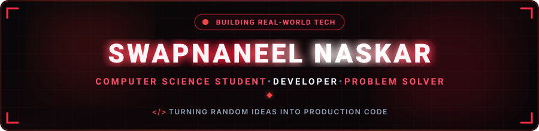
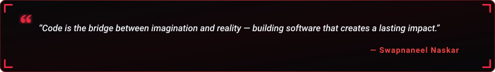

  

  

  &nbsp;  

  

<h2 align="center"> About Me</h2>

  

  

 Hey! I'm <b>Swapnaneel Naskar</b>, a passionate <b>Computer Science student & developer</b> based in India.  I specialize in architecting full-stack web applications, exploring algorithmic problem-solving, and building modern, reliable software. 

  &nbsp;  &nbsp;  

 <b>Let's Discuss:</b> C, C++, Python, Java, JavaScript, Data Structures & Algorithms, and Web Development.  <b>Philosophy:</b> <i>"I love turning random late-night thoughts into fully deployed production software!"</i> 

<table width="100%" border="0" align="center"> <tr> <td width="50%" align="center" style="padding: 14px;"> <h4> Flagship Project</h4> 
<a href="https://github.com/SwapnaneelNaskar/weather_web" target="_blank"><b>Weather Web App</b></a> Live Weather Tracking & Responsive UI
 </td> <td width="50%" align="center" style="padding: 14px;"> <h4> Active Deep Dives</h4> 
<b>DSA & Problem Solving</b> Algorithms, Trees & System Concepts
 </td> </tr> <tr> <td width="50%" align="center" style="padding: 14px;"> <h4> Learning Goals</h4> 
<b>Backend & Cloud Architecture</b> Scalable Web Services & APIs
 </td> <td width="50%" align="center" style="padding: 14px;"> <h4> Collaboration</h4> 
<b>Open Source & Web Projects</b> Open to exciting new projects
 </td> </tr> </table>

<h2 align="center"> Featured Project Spotlight</h2>

<table width="100%" border="0" align="center"> <tr> <td align="center" style="padding: 22px;"> <h3> Weather Web App</h3> 
<i>A responsive weather application designed for real-time forecast tracking, dynamic temperature metrics, and clean user experience.</i>
   
  
 </td> </tr> </table>

<h2 align="center"> Tech Stack & Skills</h2>

<b>Core Programming Languages</b>
 
  

<b>Frontend & Web Development</b>
 
  

<b>Backend, Databases & Tools</b>
 
  

<h2 align="center"> GitHub Analytics & Activity</h2>

  &nbsp;&nbsp;  

  

  

<h2 align="center"> Contribution Journey</h2>

  

<h2 align="center"> Let's Connect & Collaborate</h2>

<i>Whether you want to discuss system architecture, explore open-source collaboration, or just say hello — my inbox is always open!</i>

<table border="0" align="center"> <tr> <td align="center" width="220" style="padding: 16px;"> <a href="https://github.com/SwapnaneelNaskar" target="_blank">      </a>   <b>Code & Projects</b> </td> <td align="center" width="220" style="padding: 16px;"> <a href="mailto:swapnaneelnaskar2006@gmail.com">      </a>   <b>Direct Collaboration</b> </td> </tr> </table>

  

